<div align="center">

<!-- Animated Header -->


<br/>

<!-- Badges -->
<a href="https://arxiv.org/abs/2602.00887"></a>
<a href="https://pypi.org/project/effgen/"></a>
<a href="https://www.python.org/downloads/"></a>
<a href="https://opensource.org/licenses/MIT"></a>

<a href="https://pypi.org/project/effgen/"></a>
<a href="https://github.com/ctrl-gaurav/effGen"></a>
<a href="https://github.com/ctrl-gaurav/effGen/fork"></a>

<!-- Quick Links -->
<a href="https://arxiv.org/abs/2602.00887"></a>
<a href="https://effgen.org/"></a>
<a href="https://effgen.org/docs/"></a>
<a href="https://pypi.org/project/effgen/"></a>

<!-- Typing Animation -->


</div>

---

## 📰 News & Updates

| | Date | Update |
|:---:|:---|:---|
| 🔧 | **3 Feb 2026** | **v0.0.2 Released**: vLLM backend fixes with automatic chat template support, GPU memory control, improved OOM error handling, and multi-model family compatibility |
| 📄 | **2 Feb 2026** | Preprint available: [EffGen: Enabling Small Language Models as Capable Autonomous Agents](https://arxiv.org/abs/2602.00887) |
| 🚀 | **31 Jan 2026** | Initial release of effGen framework **(v0.0.1)** |

---

## 🤔 What is effGen?

**effGen** transforms Small Language Models into powerful AI agents. While most frameworks require massive LLMs, effGen is **optimized from the ground up** for efficient, smaller models — delivering fast, capable agents without the compute overhead.

```python
from effgen import Agent, load_model
from effgen.core.agent import AgentConfig
from effgen.tools.builtin import Calculator, PythonREPL

# Load a small but mighty model
model = load_model("Qwen/Qwen2.5-1.5B-Instruct", quantization="4bit")

# Create agent with tools
config = AgentConfig(
    name="math_agent",
    model=model,
    tools=[Calculator(), PythonREPL()]
)
agent = Agent(config=config)

# Run computation
result = agent.run("What is 24344 * 334?")
print(f"Answer: {result.output}")
```

---

## ⚡ Installation

### 📦 From PyPI (Recommended)

```bash
pip install effgen
```

### 🚀 With vLLM for Faster Inference

```bash
pip install effgen[vllm]
```

### 🔧 From Source

```bash
git clone https://github.com/ctrl-gaurav/effGen.git
cd effGen

# Quick install
./install.sh

# Full install (includes vLLM + dev tools)
./install.sh --full

# Manual install
pip install -e .
```

---

## 🚀 Quick Start

### 💻 CLI Usage

```bash
# Run a task
effgen run "What is the capital of France?"

# Interactive chat
effgen chat

# Start API server
effgen serve --port 8000

# Interactive wizard
effgen
```

### 🐍 Python API

```python
from effgen import Agent, load_model
from effgen.core.agent import AgentConfig
from effgen.tools.builtin import Calculator

# Load model
model = load_model("Qwen/Qwen2.5-1.5B-Instruct", quantization="4bit")

# Configure agent
config = AgentConfig(
    name="calculator_agent",
    model=model,
    tools=[Calculator()],
    system_prompt="You are a helpful math assistant."
)

# Create and run
agent = Agent(config=config)
result = agent.run("Calculate 15% tip on $85.50")
print(result.output)
```

---

## ✨ Features

<div align="center">

<table>
<tr>
<td align="center" width="14%">

**🧠**<br/>
SLM Optimized<br/>
<sub>For smaller models</sub>

</td>
<td align="center" width="14%">

**🔄**<br/>
Multi-Model<br/>
<sub>HF, OpenAI, etc.</sub>

</td>
<td align="center" width="14%">

**🔧**<br/>
Tool Integration<br/>
<sub>MCP, A2A, ACP</sub>

</td>
<td align="center" width="14%">

**🧩**<br/>
Task Decomp<br/>
<sub>Auto breakdown</sub>

</td>
<td align="center" width="14%">

**👥**<br/>
Multi-Agent<br/>
<sub>Coordination</sub>

</td>
<td align="center" width="14%">

**💾**<br/>
Memory<br/>
<sub>Short & Long</sub>

</td>
<td align="center" width="14%">

**🔒**<br/>
Sandboxed<br/>
<sub>Docker exec</sub>

</td>
</tr>
</table>

</div>

---

## 🛠️ Built-in Tools

<div align="center">

<table>
<tr>
<td align="center" width="14%">

**🔢**<br/>
Calculator<br/>
<sub>Math & Units</sub>

</td>
<td align="center" width="14%">

**🌐**<br/>
WebSearch<br/>
<sub>DuckDuckGo</sub>

</td>
<td align="center" width="14%">

**💻**<br/>
CodeExecutor<br/>
<sub>Sandboxed</sub>

</td>
<td align="center" width="14%">

**🐍**<br/>
PythonREPL<br/>
<sub>Interactive</sub>

</td>
<td align="center" width="14%">

**📁**<br/>
FileOps<br/>
<sub>Read/Write</sub>

</td>
<td align="center" width="14%">

**🔍**<br/>
Retrieval<br/>
<sub>RAG Search</sub>

</td>
<td align="center" width="14%">

**🎯**<br/>
AgenticSearch<br/>
<sub>Exact Match</sub>

</td>
</tr>
</table>

</div>

---

## 📚 Examples

```bash
python examples/basic_agent.py      # Basic agent (Transformers backend)

python examples/basic_agent_vllm.py # Basic agent (vLLM backend - 5-10x faster)

python examples/web_agent.py        # Web search agent

python examples/retrieval_agent.py  # RAG-based retrieval

python examples/agentic_search_agent.py # Grep-based agentic search
```

<details>
<summary><b>📖 More Examples</b></summary>

### Multi-Tool Agent

```python
from effgen import Agent, load_model
from effgen.core.agent import AgentConfig
from effgen.tools.builtin import Calculator, WebSearch, PythonREPL

model = load_model("Qwen/Qwen2.5-3B-Instruct")

config = AgentConfig(
    name="research_agent",
    model=model,
    tools=[Calculator(), WebSearch(), PythonREPL()],
    system_prompt="You are a research assistant."
)

agent = Agent(config=config)
result = agent.run("Search for the population of Tokyo and calculate what percentage it is of Japan's total population")
```

### Retrieval Agent

```python
from effgen import Agent, load_model
from effgen.core.agent import AgentConfig
from effgen.tools.builtin import Retrieval

model = load_model("Qwen/Qwen2.5-1.5B-Instruct")
retrieval_tool = Retrieval(knowledge_base_path="./docs")

config = AgentConfig(
    name="qa_agent",
    model=model,
    tools=[retrieval_tool]
)

agent = Agent(config=config)
result = agent.run("What does the documentation say about configuration?")
```

</details>

---

## 🔒 Security

<div align="center">

<table>
<tr>
<td align="center" width="33%">

**🐳**<br/>
Docker Sandbox<br/>
<sub>Isolated execution</sub>

</td>
<td align="center" width="33%">

**🛡️**<br/>
Input Validation<br/>
<sub>Auto sanitization</sub>

</td>
<td align="center" width="33%">

**⚡**<br/>
Rate Limiting<br/>
<sub>Configurable limits</sub>

</td>
</tr>
</table>

</div>

> 📋 For security policies and vulnerability reporting, see [SECURITY.md](SECURITY.md)

---

## 📖 Citation

If you use **effGen** in your research, please cite our paper:

```bibtex
@software{srivastava2026effgen,
      title={effGen: Enabling Small Language Models as Capable Autonomous Agents},
      author={Gaurav Srivastava and Aafiya Hussain and Chi Wang and Yingyan Celine Lin and Xuan Wang},
      year={2026},
      eprint={2602.00887},
      archivePrefix={arXiv},
      primaryClass={cs.CL},
      url={https://arxiv.org/abs/2602.00887},
}
```

---

## 🔗 Links

<div align="center">

<a href="https://arxiv.org/abs/2602.00887"></a>
<a href="https://effgen.org/"></a>
<a href="https://effgen.org/docs/"></a>
<a href="https://pypi.org/project/effgen/"></a>
<a href="https://github.com/ctrl-gaurav/effGen/issues"></a>

</div>

---

## 📄 License

MIT License — see [LICENSE](LICENSE) for details.

---

<div align="center">

<a href="https://effgen.org/docs/"></a>
<a href="examples/"></a>
<a href="https://arxiv.org/abs/2602.00887"></a>
<a href="https://github.com/ctrl-gaurav/effGen"></a>

**Made with ❤️ for the AI community**

<!-- Footer Wave -->


</div>
