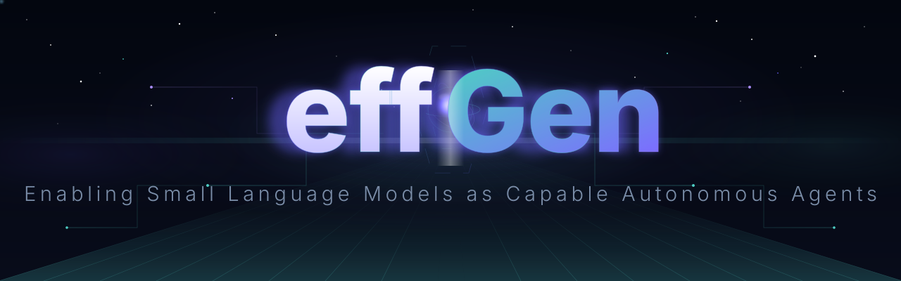

<div align="center">

<!-- Animated Header -->


<br/>
<br/>

<!-- ── Core ─────────────────────────────────────────────── -->
<a href="https://github.com/ctrl-gaurav/effGen/actions/workflows/ci.yml"></a>
<a href="https://arxiv.org/abs/2602.00887"></a>
<a href="https://pypi.org/project/effgen/"></a>
<a href="https://www.python.org/downloads/"></a>
<a href="https://opensource.org/licenses/Apache-2.0"></a>

<!-- ── Community ────────────────────────────────────────── -->
<a href="https://pepy.tech/project/effgen"></a>
<a href="https://github.com/ctrl-gaurav/effGen/stargazers"></a>
<a href="https://github.com/ctrl-gaurav/effGen/fork"></a>

<!-- ── Capabilities ─────────────────────────────────────── -->
<a href="docs/prompts/gallery.md"></a>
<a href="docs/multimodal/overview.md"></a>
<a href="docs/cookbook/README.md"></a>
<a href="docs/observability/overview.md"></a>
<a href="docs/observability/tracing.md"></a>
<a href="docs/observability/alerting.md"></a>

<!-- ── Deploy ───────────────────────────────────────────── -->
<a href="deploy/docker/Dockerfile"></a>
<a href="deploy/k8s/helm/effgen/"></a>
<a href="deploy/aws_lambda/"></a>
<a href="deploy/cloudflare/"></a>
<a href="tools/vscode-effgen/"></a>

<br/>

<!-- Typing Animation -->


<br/>
<br/>

<!-- Hero terminal (decorative; copyable code lives below) -->


<br/>
<br/>

<!-- ── Quick Navigation ─────────────────────────────────── -->
<a href="https://arxiv.org/abs/2602.00887"></a>
<a href="https://effgen.org/"></a>
<a href="https://effgen.org/docs/"></a>
<a href="https://pypi.org/project/effgen/"></a>

<br/>
<br/>

<!-- ── On-page contents ─────────────────────────────────── -->
<b>
<a href="#-what-is-effgen">What is effGen</a> &nbsp;•&nbsp;
<a href="#-installation">Install</a> &nbsp;•&nbsp;
<a href="#-quick-start">Quick Start</a> &nbsp;•&nbsp;
<a href="#-features">Features</a> &nbsp;•&nbsp;
<a href="#-agent-presets">Presets</a> &nbsp;•&nbsp;
<a href="#-built-in-tools-66">Tools</a> &nbsp;•&nbsp;
<a href="#-prompt-library">Prompts</a>
<br/>
<a href="#-multi-model-support">Models</a> &nbsp;•&nbsp;
<a href="#-examples">Examples</a> &nbsp;•&nbsp;
<a href="#-deployment">Deploy</a> &nbsp;•&nbsp;
<a href="#-developer-experience">Dev Experience</a> &nbsp;•&nbsp;
<a href="#-security">Security</a> &nbsp;•&nbsp;
<a href="#-news--updates">News</a> &nbsp;•&nbsp;
<a href="#-citation">Citation</a>
</b>

</div>

---

## 🤔 What is effGen?

**effGen** transforms Small Language Models into powerful AI agents. While most frameworks assume a massive LLM, effGen is **optimized from the ground up** for efficient, smaller models — delivering fast, capable agents without the compute overhead — while still supporting all major cloud providers when you want them.

```python
from effgen import Agent, load_model
from effgen.core.agent import AgentConfig
from effgen.tools.builtin import Calculator, PythonREPL

# Load a small but mighty model
model = load_model("Qwen/Qwen2.5-1.5B-Instruct", quantization="4bit")

# Create an agent with tools
config = AgentConfig(
    name="math_agent",
    model=model,
    tools=[Calculator(), PythonREPL()],
)
agent = Agent(config=config)

# Run a computation
result = agent.run("What is 24344 * 334?")
print(f"Answer: {result.output}")
```

<div align="center">

**9 cloud providers** &nbsp;·&nbsp; **any OpenAI-compatible server** &nbsp;·&nbsp; **4 local backends** &nbsp;·&nbsp; **66 built-in tools** &nbsp;·&nbsp; **9 presets** &nbsp;·&nbsp; **35 prompt templates** &nbsp;·&nbsp; **image / audio / video**

</div>

---

<div align="center">


</div>


## 📰 News & Updates

| | Date | Update |
|:---:|:---|:---|
| 🔧 | **8 Sep 2026** | **v1.0.1 Released** - fixes to how the framework reports what a run did, what it puts in a prompt, and what its own bookkeeping costs. A run that stops without an answer now reports `success=False`, `outcome="stopped"` and a typed `stop_reason`, keeps what it reached in `.partial`, and raises `RunStoppedError` under the default `raise_on_error=True`. Citation markers are opt-in (`cite_sources=`) and point at real sources when you ask for them. The loop guards no longer stop runs that are still working. Every tool-calling path tells the model what the tools are for. The budget check against a 500,000 row ledger went from 1,278 ms to 0.044 ms. The Groq default points at a model Groq still serves. A run costs 37% more model calls and 57% more prompt tokens than 1.0.0, and two retrieval sets got worse. [Changelog](CHANGELOG.md#101---2026-09-08) |
| 🎉 | **14 Aug 2026** | **v1.0.0 Released** — the first stable release. Point effGen at any OpenAI-compatible server (`base_url`, vLLM/Ollama/LM Studio/a gateway), read back which tool calls a run made, wrap the agent loop in middleware, give one agent many conversations with `run(session=...)`, choose a context-compaction strategy, and resume a `WorkflowDAG` that died half way through. Plus `effgen code` (a terminal coding agent), a model/pricing browser, shareable HTML reports and run cards, `effgen top`, `effgen battle`, and a long pass over everything that used to report the wrong thing: a failed run raises, an unpriced model reports no cost, and a tool call written in an unfamiliar shape is understood. **Three breaking changes** (Python 3.11 floor, `raise_on_error=True`, an unreachable backend raises). [Changelog](CHANGELOG.md#100---2026-08-14) |
| ✨ | **5 Jul 2026** | **v0.3.2 Released** — Usability, Robustness & Polish: structured output + cost gates + document input on the CLI (`batch --schema`, `eval --fail-under`, `compare --optimize cost`, `run --file`), clinical-grade PHI redaction with a `phi` preset, native web-search sources that never vanish, sampling controls (`seed`/`frequency_penalty`) that take effect, a server that returns real HTTP status on failure, provider/model/status-labeled `/metrics` with top-level alerting/SLO exports, batch that survives malformed rows with per-job cost, spreadsheet ingestion, the `general` preset on Gemini, and prompt-library input validation. No breaking changes. [Changelog](CHANGELOG.md#032---2026-07-05) |
| ✨ | **29 Jun 2026** | **v0.3.1 Released** — Real-World Usability & Polish: grounded `response.sources`/`.citations`, reasoning models (gpt-5/o-series) finish token-heavy tasks, custom personas honored on every path, fail-closed multi-agent teams/workflows, an OpenAI-compatible server with no silent tool/embedding downgrades, one-call domain agents (`LegalDomain().to_agent(...)`), `effgen run --json` + auto-discovered tool plugins + deadlock-free sync `run()` over MCP, grammar-constrained local structured output, physical GPU memory in `models status`, the REPL sandbox toggle out of the model's hands, PDFs that ingest, and per-call latency with readable sub-cent costs. No breaking changes. [Changelog](CHANGELOG.md#031---2026-06-29) |
| 🎯 | **19 Jun 2026** | **v0.3.0 Released** — Stabilization & Hardening: fail-closed `Agent.run()` (no silent success; typed redacted errors; smart retries), a self-updating drift-aware model catalog (`effgen models refresh`), real GPU support (`temperature=0`, deadlock-free allocator), a fail-closed API server (forged-JWT rejected, secure CORS/metrics/RBAC/budget), hardened built-in tools (REPL timeout, one shared SSRF guard, path confinement, no unsafe pickle/eval), `import effgen` in ~20 ms, faster streaming + agent loop, a quiet scriptable CLI, and a live "thinking" UX. No breaking changes. [Changelog](CHANGELOG.md#030---2026-06-19) |

<details>
<summary><b>📜 Earlier releases (v0.2.10 → v0.0.1)</b></summary>

<br/>

| | Date | Update |
|:---:|:---|:---|
| 🔒 | **27 May 2026** | **v0.2.10 Released**: Security, Edge & DX — secret scanning (gitleaks), SBOM (CycloneDX), pip-audit CI, sandboxed CodeExecutor (SubprocessSandbox + DockerSandbox), OAuth2/OIDC + RBAC + audit log, Docker + Helm, AWS Lambda (Mangum), Cloudflare Worker edge proxy, VSCode extension, Jupyter magics, live dashboard. [Changelog](CHANGELOG.md#0210---2026-05-27) |
| 📊 | **23 May 2026** | **v0.2.9 Released**: Observability & Reliability — structured JSON logs + secret redaction, OTel samplers + canonical span spec, Prometheus histograms, SLO tracking, circuit breakers, bulkheads, jittered retries, chaos harness, fuzz suite, `effgen loadtest` CLI, Alertmanager rules. [Changelog](CHANGELOG.md#029---2026-05-23) |
| 🖼️ | **21 May 2026** | **v0.2.8 Released**: Multimodal input — image, audio, and video across 6 providers (Gemini, OpenAI, Groq, Anthropic, Together, HF). New `multimodal` preset, `MultimodalDescribeTool`, unified `Message` content schema, 5 cookbook walkthroughs. [Changelog](CHANGELOG.md#028---2026-05-21) |
| 📚 | **20 May 2026** | **v0.2.7 Released**: 31 prompt templates across 7 domains — research, coding, data/SQL, legal, medical, creative, business — with golden eval harness, interactive playground, and auto-generated gallery. [Changelog](CHANGELOG.md#027---2026-05-20) |
| 🚀 | **19 May 2026** | **v0.2.6 Released**: 14 new tools — OCR, AudioTranscribe, ImageInfo, ImageCaption, PDF, DOCX, Excel, Weather, Geocode, Maps, EmailSMTP, EmailIMAP, SlackWebhook, DiscordWebhook. New presets: `media`, `notify`. 58+ built-in tools total. [Changelog](CHANGELOG.md#026---2026-05-19) |
| 🚀 | **18 May 2026** | **v0.2.5 Released**: 13 new free tools — PubMed, ArXiv, SemanticScholar, RSS, News, YouTubeTranscript, YouTubeMetadata, Reddit, HackerNews, Translate, LanguageDetect, QRGenerate, QRRead. 44+ built-in tools total. [Changelog](CHANGELOG.md#025---2026-05-18) |
| 🚀 | **14 May 2026** | **v0.2.4 Released**: ModelRouter with CostBased/LatencyBased/FirstAvailable policies, transparent provider failover, cross-process SQLite rate-limit coordination, persistent cost tracker + `effgen cost` dashboard CLI. [Changelog](CHANGELOG.md#024---2026-05-14) |
| 🚀 | **4 May 2026** | **v0.2.3 Released**: 5 new cloud backends (Groq, Together AI, Fireworks, Replicate, HuggingFace Inference) — 9 providers total. Unified ProviderRegistry, `effgen doctor` auth check, backend parity matrix. [Changelog](CHANGELOG.md#023---2026-05-04) |
| 🚀 | **28 Apr 2026** | **v0.2.2 Released**: Gemini 3.x/2.5/2.0 registry, `thinking_budget`, Google Search grounding, Files API, Gemini native tools (GoogleSearch, UrlContext, CodeExecution). Anthropic Claude 4.7 registry, extended thinking, prompt caching (`cache_control`), streaming polish, experimental native tools. [Changelog](CHANGELOG.md#022---2026-04-28) |
| 🚀 | **25 Apr 2026** | **v0.2.1 Released**: Cerebras backend (streaming, native tool-calling, rate-limit coordinator, cost tracking) + OpenAI gpt-5/gpt-5.4-nano/o-series with `reasoning_effort`, prompt caching, structured outputs v2, and OpenAI native tools (web_search, code_interpreter, file_search). [Changelog](CHANGELOG.md#021---2026-04-25) |
| 🚀 | **9 Apr 2026** | **v0.2.0 Released**: Major release — native tool calling, guardrails, multi-agent orchestration, RAG pipeline, 31 tools, eval framework, production API server, MLX Apple Silicon support, Python & TypeScript SDKs. [Changelog](CHANGELOG.md#020---2026-04-09) |
| 🍎 | **8 Apr 2026** | **MLX & Apple Silicon support merged** (PR #4): Native Metal GPU acceleration via MLX & MLX-VLM backends, hardware detection, 5 Gradio GUI examples. `pip install effgen[mlx]` |
| 🔧 | **25 Mar 2026** | **v0.1.3 Released**: Verification hardening — smarter loop detection, "skip the tool" prompting, model-aware token counting, sub-agent depth limits, circuit breaker persistence. [Changelog](CHANGELOG.md#013---2026-03-25) |
| 🔧 | **12 Mar 2026** | **v0.1.2 Released**: Test-driven hardening — 10 example agents, 19 bug fixes, cross-model compatibility matrix (11 models, 73% pass rate). [Changelog](CHANGELOG.md#012---2026-03-12) |
| 🔒 | **6 Mar 2026** | **v0.1.1 Released**: Stabilization — fixed license/metadata consistency, improved error handling, added 6 examples, expanded test suite. [Changelog](CHANGELOG.md#011---2026-03-06) |
| 🎉 | **1 Mar 2026** | **v0.1.0 Released**: Major feature release — 14 built-in tools, agent presets, plugin system, real streaming, memory integration, ACP/MCP protocols, CI/CD, and comprehensive test suite. [Changelog](CHANGELOG.md#010---2026-03-01) |
| 🔧 | **3 Feb 2026** | **v0.0.2 Released**: vLLM backend fixes with automatic chat template support, GPU memory control, improved OOM error handling, and multi-model family compatibility |
| 📄 | **2 Feb 2026** | Preprint available: [EffGen: Enabling Small Language Models as Capable Autonomous Agents](https://arxiv.org/abs/2602.00887) |
| 🚀 | **31 Jan 2026** | Initial release of effGen framework **(v0.0.1)** |

</details>

---


## ⚡ Installation

> **Requires Python 3.11 or newer.** Tested on Python 3.11, 3.12, 3.13 and 3.14.

```bash
pip install effgen            # from PyPI (recommended)
```

<table>
<tr><th align="left">Target</th><th align="left">Command</th><th align="left">What you get</th></tr>
<tr><td>🍎 <b>Apple Silicon</b></td><td><code>pip install effgen[mlx]</code></td><td>Text models on Metal GPU</td></tr>
<tr><td>🍎 <b>Apple Silicon (VLM)</b></td><td><code>pip install effgen[mlx-vlm]</code></td><td>Vision-language models on Metal GPU</td></tr>
<tr><td>🚀 <b>NVIDIA / vLLM</b></td><td><code>pip install effgen[vllm]</code></td><td>High-throughput batch inference</td></tr>
<tr><td>🎁 <b>Everything</b></td><td><code>pip install effgen[all]</code></td><td>vLLM + RAG + vector-DB + search + monitoring + …</td></tr>
</table>

<details>
<summary><b>⚡ Optional: flash-attn (NVIDIA GPUs only — 2 steps)</b></summary>

<br/>

`flash-attn` is **not** in `[all]` on purpose: its own `setup.py` imports `torch` before pip's isolated
build environment has torch installed (a well-known upstream bug), so bundling it would break
`pip install effgen[all]` for everyone. Install it in two steps instead:

```bash
pip install effgen[all]                       # step 1: gets torch + the rest
pip install flash-attn --no-build-isolation   # step 2: reuses the torch from step 1
```

</details>

<details>
<summary><b>🔧 From source</b></summary>

<br/>

```bash
git clone https://github.com/ctrl-gaurav/effGen.git
cd effGen

./install.sh            # quick install
./install.sh --full     # full install (includes vLLM + dev tools)
pip install -e .        # manual editable install
```

</details>

See [docs/installation.md](docs/installation.md) for the full guide.

---


## 🚀 Quick Start

<table>
<tr>
<td width="50%" valign="top">

**💻 Command line**

```bash
# Run a task
effgen run "What is the capital of France?"

# Interactive chat
effgen chat

# Start the API server
effgen serve --port 8000

# List presets · check health · wizard
effgen presets
effgen health
effgen
```

</td>
<td width="50%" valign="top">

**🐍 Python API**

```python
from effgen import Agent, load_model
from effgen.core.agent import AgentConfig
from effgen.tools.builtin import Calculator

model = load_model("Qwen/Qwen2.5-1.5B-Instruct",
                   quantization="4bit")

agent = Agent(config=AgentConfig(
    name="calculator_agent",
    model=model,
    tools=[Calculator()],
    system_prompt="You are a helpful math assistant.",
))
result = agent.run("Calculate 15% tip on $85.50")
print(result.output)
```

</td>
</tr>
</table>

<details>
<summary><b>🍎 Apple Silicon (MLX) quick start</b></summary>

<br/>

```python
from effgen import Agent, load_model
from effgen.core.agent import AgentConfig
from effgen.tools.builtin import Calculator

# Native Metal GPU, unified memory, no CPU-GPU transfer
model = load_model("LiquidAI/LFM2.5-1.2B-Instruct-MLX-8bit", engine="mlx")

agent = Agent(config=AgentConfig(name="mlx_agent", model=model, tools=[Calculator()]))
result = agent.run("What is sqrt(144) + 2^10?")
print(result.output)
```

</details>

---


## ✨ Features

<div align="center">

<table>
<tr>
<td align="center" width="14%">

**🧠**<br/>
SLM Optimized<br/>
<sub>Small models</sub>

</td>
<td align="center" width="14%">

**🍎**<br/>
Apple Silicon<br/>
<sub>MLX + Metal GPU</sub>

</td>
<td align="center" width="14%">

**🛡️**<br/>
Guardrails<br/>
<sub>PII, injection, safety</sub>

</td>
<td align="center" width="14%">

**📚**<br/>
RAG Pipeline<br/>
<sub>Ingest, search, cite</sub>

</td>
<td align="center" width="14%">

**👥**<br/>
Multi-Agent<br/>
<sub>DAG workflows</sub>

</td>
<td align="center" width="14%">

**🖼️**<br/>
Multimodal<br/>
<sub>image/audio/video</sub>

</td>
<td align="center" width="14%">

**🏭**<br/>
Production API<br/>
<sub>OpenAI-compat</sub>

</td>
<td align="center" width="14%">

**📊**<br/>
Observability<br/>
<sub>metrics/traces/SLOs</sub>

</td>
</tr>
</table>

</div>

<details open>
<summary><b>🆕 What's new in v1.0.1</b></summary>

<br/>

**This release fixes how the framework reports what a run did, what it puts in a prompt, and what
its own bookkeeping costs.** None of it is tuned for a benchmark. Four changes are visible to
existing code, and one of them changes what `success` means for a run that stopped part way.

| Area | What changed |
|------|--------------|
| **A run that stops says so** | Three paths that returned `success=True` with internal state in `.output` now return `success=False`, `outcome="stopped"`, a typed `stop_reason`, and what the model reached in `.partial`. With the default `raise_on_error=True` they raise `RunStoppedError`, a `RuntimeError` that carries the response. |
| **Citations are opt-in** | 1.0.0 asked every retrieval answer for `[1]`, `[2]` markers whether you wanted them or not, and they pointed at nothing. Ask with `AgentConfig(cite_sources=True)` or `run(cite_sources=True)`. The `rag` preset asks already, and when you ask, `[n]` is `citations[n - 1]`. |
| **Streaming shows the working** | The final answer is the same, but a streamed run now sends the model's reasoning first. 8 chunks became 134 on the same task. |
| **The budget check** | 1,278 ms to 0.044 ms warm against a 500,000 row ledger, using a covering index instead of a full scan. `effgen cost prune` keeps the file small. |
| **Loop guards** | A repeated call is answered from the run's own record and the run keeps going, and the loop gets one turn to answer before it stops. Over a 200 run sample the two guards fired 69 times before and once now. |
| **Tool use is a decision** | `AgentConfig(tool_use="required"/"auto"/"sparing")` and `AgentConfig(tool_contract=...)`, both picked from a tool's declared category. Every shipped default matches 1.0.0. `tool_choice` is a `run()` keyword and reaches the provider. |
| **Groq default works again** | Groq retired the two `llama` ids this project shipped. The default, the bundled catalog, the CLI help and every example now name `openai/gpt-oss-20b`. |

```python
from effgen import Agent, AgentConfig, RunStoppedError

agent = Agent(AgentConfig(model="openai:gpt-5-nano"))
try:
    response = agent.run("What is 17 * 23?")
    print(response.outcome, response.stop_reason)
    print(response.text)
except RunStoppedError as exc:
    print(exc.stop_reason)
    print(exc.partial.text if exc.partial else "nothing to report")
```

```bash
effgen runs list --status stopped      # runs that ended before an answer was written
effgen cost prune --older-than-days 30 --dry-run
```

**What it cost.** A run makes 37% more model calls and sends 57% more prompt tokens than 1.0.0, and
two retrieval sets got worse. The full measurement is in the changelog.

[Full v1.0.1 changelog](CHANGELOG.md#101---2026-09-08)

</details>

<details>
<summary><b>🆕 What's new in v1.0.0 — the first stable release</b></summary>

<br/>

**v1.0.0 is about control over where a model runs and visibility into what a run did** — drive any
server speaking the OpenAI protocol, read back the calls a run made, extend the agent loop — and it
adds the surfaces that make a run easy to drive, watch and
share. The largest and least visible part of the release is a pass over everything that used to report
the wrong thing confidently: a failed run now says so, an unpriced model reports no cost, and a turn
that did nothing is not a success. **Three changes are breaking**, each with a one-line migration in
the changelog.

| Area | What changed |
|------|--------------|
| **Any OpenAI-compatible server** | `load_model(..., provider="openai_compatible", base_url=...)` drives vLLM, SGLang, TGI, llama.cpp, Ollama, LM Studio, LiteLLM or a gateway. The server's ids, no fabricated `$0`. |
| **The calls, not the count** | `AgentResponse.tool_calls` carries `name`, `arguments`, `result`, `duration`, `error` and `iteration`, with `.failed` and `.by_name()`. `tool_calls == 2` still works. |
| **Middleware, sessions, compaction** | Hooks around the run, each model call and each tool call; `run(session=...)` for one agent serving many conversations; `SummarizeOldest`/`DropOldest`/`KeepFirstAndLast`/`KeepToolResults`. |
| **Resumable workflows** | `WorkflowDAG.run(checkpoint=FileCheckpointStore(), run_id=...)`. Run the same line again after a crash and it continues; completed nodes are not re-run. |
| **A coding agent** | `effgen code` proposes unified diffs, writes nothing until you say so, `--undo` reverses, `--review` is read-only, `--session-id` resumes, and git actions run through an allow-list. |
| **Surfaces to show someone** | Real-time dashboard, in-browser playground, `effgen models browse`, shareable HTML reports and run cards, `effgen top`, `effgen battle`, topology graph, command palette. All self-contained, no CDN. |
| **Truthful results** | Iteration cap, reasoning-only turns, written-out tool calls and failed actions are reported as what they are, with the recovered text under `metadata["partial_output"]`. |
| **Truthful cost** | No invented price for an uncatalogued or `ft:` model, streamed cost and tokens on every provider, and per-model spend that adds up. |
| **Tools on more models** | A tool call written as XML tags is understood, one call shape across every adapter, and arguments survive their own punctuation. |
| **Errors that name the fix** | A scheme-less URL names the variable it came from, a connection failure names the endpoint, messages are bounded and redacted, and a 413 that means a rate limit is one. |
| **Sandboxing** | Executed code cannot read your credential stores and sees its own process table (`credential_reads_masked`, `process_table_isolated`). |
| **Python 3.11 to 3.14** | The floor moved to 3.11; 3.14 is supported and was installed and run, with a shipped lock for the `all` extra. |

```python
from effgen.models import load_model

model = load_model(
    "Qwen/Qwen2.5-7B-Instruct",
    provider="openai_compatible",
    base_url="http://127.0.0.1:8000/v1",
)
```

```bash
effgen code "add a --dry-run flag to the importer"   # diffs first, writes on your word
effgen models browse --vision --min-context 128000 --sort price-out
effgen battle "Explain gradient clipping" -m groq:openai/gpt-oss-20b,gemini:gemini-3.1-flash-lite
effgen top                                           # terminal mission control
```

[Full v1.0.0 changelog →](CHANGELOG.md#100---2026-08-14)

</details>

<details>
<summary><b>🆕 What's new in v0.3.2 — Usability, Robustness & Polish</b></summary>

<br/>

**v0.3.2 keeps sanding down the edges** — this time for a reliability engineer, a trust auditor, a
security engineer, an ETL engineer, a clinical analyst, an SRE, a localizer, a CI gatekeeper, a
non-technical operator, a game writer, a plugin author, a FinOps owner, and a document specialist. No new
providers or subsystems — the surfaces you already reach for are now more predictable, and every quiet
trap now surfaces a clear, typed error. **No breaking API changes** — every change is additive.

| Area | What changed |
|------|--------------|
| **Structured output on the CLI** | `effgen batch --schema` validates every row against a JSON Schema / Pydantic model; the output file is lossless (cost, tokens, parsed, failure reason); `--temperature`, `--persona`, `--resume` too. |
| **CI accuracy gates** | `effgen eval --fail-under 0.8` drives the exit code, and `--compare-baseline` fails the build on a real regression. |
| **Cost-aware selection** | `effgen compare --optimize cost` adds a `$/run` column and picks the cheapest good-enough model. |
| **Document & file input** | `effgen run --file report.pdf` reads a PDF/DOCX/XLSX/text document or an image — no Python needed. |
| **Clinical-grade redaction** | PHI redaction covers name/DOB/MRN/address/member-ID, `custom_patterns`, strict fail-closed mode, and a new `phi` preset. |
| **Grounding that never vanishes** | Native web search surfaces the URLs it searched even when the model answers without inline citations. |
| **Sampling that takes effect** | `seed`, `frequency_penalty`, `presence_penalty`, `top_k` reach the model; an unknown `run()` kwarg is now rejected. |
| **A consistent server** | A failed completion returns a real 4xx/5xx envelope instead of an HTTP 200 with the error as the answer. |
| **Observability you alert on** | `/metrics` carries provider/model/status labels; `AlertWebhook`/`SLOTracker` are exported top-level. |
| **Resilient batch & intake** | One malformed row no longer aborts the job (skipped + reported), spreadsheets ingest, and a folder ingest never silently drops a file. |

```python
from effgen import PIIGuardrail, get_guardrail_preset

# Redaction that covers the labeled clinical identifiers, plus site-specific patterns.
g = PIIGuardrail(action="redact", custom_patterns=[(r"MRN[:#]\s*\d+", "[MRN REDACTED]")])
print(g.check("Jane Doe  DOB: 1980-02-14  MRN: 55123").modified_content)
# "[NAME REDACTED]  DOB: [DOB REDACTED]  MRN: [MRN REDACTED]"

chain = get_guardrail_preset("phi")   # redaction + fail-closed strict mode
```

```bash
effgen batch --input tickets.jsonl --output out.jsonl -m groq:openai/gpt-oss-20b --schema schema.json
effgen eval --suite cases.jsonl -m groq:openai/gpt-oss-20b --fail-under 0.9   # exit 1 if it drops
effgen compare --models "groq:openai/gpt-oss-20b,gemini:gemini-3.1-flash-lite" --suite cases.jsonl --optimize cost
effgen run "What was Q3 revenue?" --file report.pdf -m groq:openai/gpt-oss-20b
```

[Full v0.3.2 changelog →](CHANGELOG.md#032---2026-07-05)

</details>

<details>
<summary><b>📦 Previous releases — v0.3.1 down to v0.2.0 (click to expand)</b></summary>

<br/>

<details>
<summary><b>What's new in v0.3.1 — Real-World Usability & Polish</b></summary>

<br/>

Where v0.3.0 hardened the framework, **v0.3.1 sands down the edges** real professionals hit the moment
they sit down with it. No new providers or subsystems — the things you already reach for are now more
predictable, measurable, and consistent. **No breaking API changes** — every change is additive or makes
a previously-silent failure surface a clear, typed error.

| Area | What changed |
|------|--------------|
| **Traceable evidence** | `response.sources` / `.citations` are populated from the URLs a run actually retrieved (and provider-native grounding) — never from the model's prose. |
| **Reasoning models** | The `gpt-5` family and `o`-series finish token-heavy tasks instead of returning an empty, billed result; length-truncation is grown and retried once, not three times. |
| **Measurable results** | `cost_usd`, token counts, and `latency_ms` land on every result (local stays cost-free); teams/workflows report summed cost; sub-cent costs show real digits. |
| **Personas everywhere** | A custom `system_prompt` now steers the direct, streaming, and native-tool paths — not just text-ReAct. |
| **Trustworthy orchestration** | Collaborative teams fail closed, hierarchical teams route by the named worker, and a workflow never runs downstream of a failed node. |
| **Consistent server** | No silent client-tool drop (clear `400`), embeddings reflect their real backend, a unified error envelope, and per-call cost. |
| **One-call domains** | `LegalDomain().to_agent("gpt-5-nano")` wires a domain's prompt, tools, and guardrails into a runnable agent. |
| **Local-first truth** | `models status` shows physical GPU memory, `models info` is cache-aware, local batch is thread-safe, and grammar-constrained JSON via `effgen[grammar]`. |
| **Dependable automation** | Sync `Agent.run()` no longer hangs on MCP tools, tool plugins auto-discover, and `effgen run --json` pipes clean JSON to stdout. |
| **Hardened tools** | The Python REPL sandbox toggle is out of the model's hands; the bash env scrub covers every credential; broader injection detection and credential-aware PII redaction. |

```python
from effgen import create_agent, LegalDomain

# Grounded research: sources/citations come from the URLs the tools retrieved.
agent = create_agent("research", "openai:gpt-5-nano")
r = agent.run("What is the capital of France? Cite a source.")
print(r.text)                  # "...Paris (Source: https://en.wikipedia.org/wiki/Paris)."
print(r.sources)               # ['https://en.wikipedia.org/wiki/Paris']
print(r.metadata["cost_usd"], r.metadata["latency_ms"])

# A knowledge domain becomes a runnable agent in one call.
legal = LegalDomain().to_agent("openai:gpt-5-nano")
print(legal.run("What does an NDA confidentiality clause protect?").text)
```

```bash
effgen run --json -q "What is 25 * 17?" | jq .output   # pure-JSON stdout for CI
effgen models status                                    # physical GPU memory; which card is free
```

[Full v0.3.1 changelog →](CHANGELOG.md#031---2026-06-29)

</details>

<br/>

<details>
<summary><b>What's new in v0.3.0 — Stabilization & Hardening</b></summary>

<br/>

**effGen v0.3.0** made the framework production-safe from the inside out. **No breaking API changes.**

- **Fail-closed `Agent.run()`** — no silent success; typed, redacted errors; smarter retries and loop
  detection.
- **Self-updating, drift-aware model catalog** — `effgen models refresh` reconciles the local snapshot
  against live provider lists (chat models only; never persists `ft:` ids).
- **Real GPU support** — deterministic `temperature=0`, a deadlock-free allocator, clean multi-GPU use.
- **Fail-closed API server** — forged/expired/wrong-alg JWTs rejected; secure CORS, metrics, RBAC, and
  budget enforcement.
- **Hardened built-in tools** — Python REPL timeout, one shared SSRF guard, path confinement, and no
  unsafe `pickle`/`eval`.
- **Faster & quieter** — `import effgen` in ~20 ms, faster streaming + agent loop, a scriptable CLI, and
  a live "thinking" UX.

[Full v0.3.0 changelog →](CHANGELOG.md#030---2026-06-19)

</details>

<details>
<summary><b>What's new in v0.2.9 — Observability & Reliability</b></summary>

<br/>

**effGen v0.2.9** ships the full observability and reliability stack. All telemetry is async/non-blocking — a failed export never fails inference.

**Structured JSON logging with secret redaction.** Every log line is a JSON object: `{ts, level, module, event, attributes, trace_id, span_id}`. The built-in `Redactor` strips OpenAI, Anthropic, Cerebras, Google, HF, Groq, Bearer, Slack, and Discord webhook patterns at the encoder — no secret ever appears in a log file.

```python
from effgen.observability import get_logger
log = get_logger(__name__)
log.event("model.call.started", provider="cerebras", model="gpt-oss-120b", cached_tokens=0)
# → {"ts": "2026-05-23T...", "level": "INFO", "event": "model.call.started", ...}
```

**Prometheus histograms + SLO tracking.** `effgen_model_call_latency_seconds`, `effgen_tool_call_latency_seconds`, `effgen_agent_iteration_latency_seconds`, and `effgen_tokens_total` now expose histogram buckets at `/metrics`. `SLOTracker` maintains a rolling-window error budget and `burn_rate()` at `/slo`.

**Configurable OTel samplers + canonical span spec.** Choose `AlwaysOn`, `AlwaysOff`, `TraceIdRatio(p)`, or `RateLimited(per_second)` in config. `effgen/observability/spans.py` is the single source of truth for every span attribute name.

**Reliability primitives.** Four layers now protect every adapter call:

| Primitive | Class | What it does |
|-----------|-------|-------------|
| Timeouts | `ReliabilityConfig` | `model_call=60s`, `tool_call=30s`, `http=20s` — explicit on every httpx client |
| Retries | `@retryable(Retry(...))` | Jittered exponential backoff for 5xx / 429 / network errors; emits OTel events |
| Circuit breaker | `CircuitBreaker` | CLOSED → OPEN → HALF_OPEN per provider; isolates misbehaving backends |
| Bulkhead | `Bulkhead` | Per-provider concurrency + queue limit; prevents provider starvation |

**Deterministic chaos harness.** Inject `NetworkTimeout`, `Http5xx`, `Http429`, `SlowResponse`, `PartialResponse`, or `MalformedJSON` faults with `Chaos(seed)`. Four canonical scenarios — fallback on 5xx, Retry-After honoured, timeout fires cleanly, AllProvidersFailed — all pass deterministically across 10 seeds.

**Fuzz suite.** Hypothesis runs 500 examples against all 66 `BaseTool` subclasses, random `ContentPart` message sequences, and the router's provider-availability logic. No unhandled exceptions, no secret leaks.

**Load-testing CLI + Alertmanager rules.**

```bash
# Run a 30-second load test (JSON report prints to stdout by default)
effgen loadtest --concurrency 10 --duration 30 --scenario fixed

# Or write the report to a file with --output
effgen loadtest --concurrency 10 --duration 30 --output report.json

# Integrate with Alertmanager
cp docs/observability/alert_rules.yaml /etc/prometheus/rules/effgen.yaml
```

See [docs/observability/overview.md](docs/observability/overview.md), [docs/observability/metrics.md](docs/observability/metrics.md), and [docs/observability/alerting.md](docs/observability/alerting.md).

</details>

<details>
<summary><b>What's new in v0.2.8 — Multimodal input (image, audio & video across 6 providers)</b></summary>

<br/>

**effGen v0.2.8** accepts image, audio, and video as input types. Send them to any vision-capable provider through a unified `Message` schema — the adapter handles the translation, not your code.

**Image input** — Gemini, OpenAI gpt-4o, Groq, Anthropic (code-only), Together, HF. Automatic resize/MIME validation via `image_pre.py`. Raises `CapabilityNotSupportedError` cleanly when the provider doesn't support vision.

**Audio input** — Gemini native inline audio, OpenAI Whisper transcription + gpt-4o audio, HF Inference ASR. Auto-downsamples to 16 kHz mono; chunks files over provider max duration. Anthropic raises `CapabilityNotSupportedError`.

**Video input** — Gemini native video for providers that accept raw video; frame-sampling fallback (ffmpeg) for all others. `MissingSystemDependency` with install hints when ffmpeg is absent.

**Unified message schema** — `TextPart`, `ImagePart`, `AudioPart`, `VideoPart` form a typed `ContentPart` union. `Message.content` is always a `List[ContentPart]`; backwards-compatible string constructor still works.

**`multimodal` preset** — `create_agent("multimodal", model)` wires Gemini Flash-Lite (primary) + OpenAI gpt-4o-mini (fallback) with `ImageInfo`, `ImageCaption`, `OCR`, `AudioTranscribe`, `MultimodalDescribeTool`, and the full tool suite.

**5 cookbook walkthroughs** — image Q&A, audio transcribe + reason, video summarize, OCR + LLM structured extraction, chart reading from an image. All in `docs/cookbook/`.

```python
from effgen import image_from, audio_from
from effgen.presets import create_agent
from effgen import load_model

model = load_model("gemini-3.1-flash-lite", provider="gemini")
agent = create_agent("multimodal", model)

# Image question — pass media through inputs=
img = image_from("https://upload.wikimedia.org/wikipedia/commons/4/47/PNG_transparency_demonstration_1.png")
result = agent.run("What is in this image?", inputs=[img])
print(result.output)

# Audio transcription
aud = audio_from("/tmp/clip.mp3")
result = agent.run("Transcribe and summarize.", inputs=[aud])
```

```bash
effgen run --preset multimodal "Describe this image" --image /tmp/photo.jpg
python -c "from effgen.models.capabilities import Capability; print(Capability.vision)"
```

See [docs/multimodal/overview.md](docs/multimodal/overview.md) and [docs/cookbook/README.md](docs/cookbook/README.md).

</details>

<details>
<summary><b>What's new in v0.2.7 — Prompt Library, Eval Harness & Interactive Playground</b></summary>

<br/>

**effGen v0.2.7** adds a curated, domain-organized **Prompt Library** with reusable templates, paired with a golden evaluation harness and an interactive playground CLI. See the [full gallery](docs/prompts/gallery.md).

**Research** — literature review (zero-shot + CoT), paper summary, citation extraction, methodology critique.
**Coding** — code review, bug diagnosis, refactoring plan, test generation, docstring fill.
**Data / SQL** — NL-to-SQL with warnings, SQL explain, SQL optimize, data profile, ETL plan.
**Legal** — contract summary, clause classify, research brief. All templates include mandatory legal disclaimer.
**Medical** — symptom triage, drug interaction, medical literature synthesis. All templates include mandatory medical disclaimer.
**Creative** — story continuation (zero-shot + few-shot), poetry forms, character bio, world building.
**Business** — meeting summary, email draft (formal/casual), OKR generation, SWOT analysis, elevator pitch.

```bash
effgen prompts list
effgen prompts list --domain research
effgen prompts show research.literature_review.v1.cot
effgen prompts eval --domain coding --live --model gpt-oss-120b
effgen prompts playground
```

```python
from effgen.prompts.library import registry

p = registry.get("data.sql_from_nl.v1")
sql_prompt = p.template(
    schema_ddl="CREATE TABLE orders (id INT, customer TEXT, total FLOAT, created_at DATE)",
    question="Total revenue per customer this month",
    dialect="postgresql",
)
```

See [docs/prompts/gallery.md](docs/prompts/gallery.md) and [docs/prompts/library.md](docs/prompts/library.md).

</details>

<details>
<summary><b>What's new in v0.2.6 — 14 tools: OCR, audio, images, documents, geo/weather & comms</b></summary>

<br/>

**effGen v0.2.6** adds 14 new built-in tools across document, media, and communication categories, and two new presets (`media`, `notify`).

1. **OCR** — `OCRTool` (Tesseract local + OCR.space fallback; `OCRBackendUnavailable` raised with install instructions).

   ```python
   import asyncio
   from effgen.tools.builtin.ocr import OCRTool
   result = asyncio.run(OCRTool().execute(operation="extract", image_path="/tmp/scan.png"))
   print(result.output["text"])
   ```

2. **Audio Transcription** — `AudioTranscribeTool` (faster-whisper local; HF Inference fallback; GPU auto-detected).

3. **Image Analysis** — `ImageInfoTool` (Pillow metadata, zero network) + `ImageCaptionTool` (vision-capable model router).

4. **Document Parsing** — `PDFTool` (pypdf + pdfplumber), `DOCXTool` (python-docx), `ExcelTool` (openpyxl + pandas). Added to `research` and `general` presets.

   ```python
   import asyncio
   from effgen.tools.builtin.pdf import PDFTool
   result = asyncio.run(PDFTool().execute(operation="text", path="/tmp/paper.pdf"))
   ```

5. **Geo / Weather** — `WeatherTool` (Open-Meteo, free, no auth), `GeocodeTool` (Nominatim/OSM, 1 req/s), `MapsTool` (staticmap PNG renderer).

6. **Email & Webhooks** — `EmailSMTPTool`, `EmailIMAPTool`, `SlackWebhookTool`, `DiscordWebhookTool`. All in the new `notify` preset. Webhook URLs are redacted in logs.

See the [full tool gallery](docs/tools/gallery.md).

</details>

<details>
<summary><b>What's new in v0.2.5 — 13 free tools: research, news, YouTube, social, translation & QR</b></summary>

<br/>

**effGen v0.2.5** adds 13 free, no-auth-required tools. All integrate with the `research` and `general` presets.

1. **Academic Research** — `PubMedTool` (NCBI, 3 ops, built-in rate limiting), `ArXivTool` (Atom feed + PDF download), `SemanticScholarTool` (search + citations + references).

   ```python
   import asyncio
   from effgen.tools.builtin.arxiv import ArXivTool
   result = asyncio.run(ArXivTool().execute(operation="search", query="transformer attention", max_results=5))
   ```

2. **News & RSS** — `RSSFeedTool` (any RSS/Atom feed), `NewsTool` (BBC, Reuters, HN, NPR, etc. + optional NewsAPI.org key).

3. **YouTube** — `YouTubeTranscriptTool` (captions without Google API key), `YouTubeMetadataTool` (via yt-dlp, public content only).

4. **Social Media** — `RedditTool` (public JSON, no OAuth), `HackerNewsTool` (Firebase API, no auth).

5. **Translation & Language Detection** — `TranslateTool` (LibreTranslate + offline argostranslate fallback), `LanguageDetectTool` (55+ languages, fully offline).

6. **QR Codes** — `QRGenerateTool` (generate locally), `QRReadTool` (decode from image, with OpenCV fallback if zbar is unavailable).

See the [full tool gallery](docs/tools/gallery.md).

</details>

<details>
<summary><b>What's new in v0.2.4 — ModelRouter & Cost Optimizer</b></summary>

<br/>

1. **`PolicyBasedRouter`** — composable routing engine with three built-in policies. Pick the cheapest provider within your budget, the fastest under your SLA, or simply the first available.

   ```python
   from effgen import PolicyBasedRouter, RoutingContext, CostBasedPolicy, LatencyBasedPolicy
   from effgen.models.capabilities import Capability

   router = PolicyBasedRouter(policies=[LatencyBasedPolicy(), CostBasedPolicy()])
   ctx = RoutingContext(
       prompt_tokens_estimate=500,
       user_budget_usd=0.01,
       latency_budget_ms=3000,
       required_capabilities={Capability.chat},
   )
   decision = router.route(ctx)
   print(decision.chosen)      # e.g., ProviderModelPair("cerebras", "gpt-oss-120b")
   print(decision.eliminated)  # [(pair, reason), ...] — fully explainable
   ```

2. **Transparent failover** — `route_and_execute(ctx, fn)` retries on rate-limits / 5xx / timeouts and moves to the next-best provider. Each hop fires a `RouterEvent` to registered subscribers.

3. **Cross-process SQLite rate-limit coordination** — share a single rate-limit budget across multiple workers via `RateLimitCoordinator(SQLiteRateLimitStore(...))` (WAL-mode, BEGIN IMMEDIATE).

4. **Persistent cost tracking + `effgen cost` CLI** — every API call persists to SQLite:

   ```bash
   effgen cost today          # per-provider per-model table
   effgen cost week           # rolling 7-day view
   effgen cost by-provider    # lifetime totals
   effgen cost set-budget 1.0 # set $1/day cap (BudgetExceededError at 100%)
   ```

5. **Fully explainable decisions + budget guard** — `RouterDecision` records every eliminated provider and why (`"rate_limited"`, `"no_key"`, `"cost_exceeds_budget"`, `"latency_exceeds_sla"`), and fails over to a free-tier provider when the budget is hit.

</details>

<details>
<summary><b>What's new in v0.2.3 — 5 new cloud backends (9 providers total)</b></summary>

<br/>

1. **5 new cloud backends** — `GroqAdapter`, `TogetherAdapter`, `FireworksAdapter`, `ReplicateAdapter`, `HFInferenceAdapter` — each with streaming, native tools, rate-limit coordination, and cost tracking. 9 providers total.

   ```python
   model = load_model("openai/gpt-oss-20b", provider="groq")
   model = load_model("Qwen/Qwen2.5-72B-Instruct", provider="hf")
   ```

2. **Unified ProviderRegistry** — `list_providers()`, `list_models(provider)`, `lookup(model_id)` consolidated across all 9 adapters. `AmbiguousModelError` on bare IDs shared across providers.

3. **`effgen doctor`** — new CLI command showing which providers have API keys configured.

4. **Backend parity matrix** — canonical agentic task ("(17 × 23) + sqrt(144) = 403") runs identically across all providers; streaming and error surfaces verified uniform. See `docs/providers/parity.md`.

5. **HuggingFace Router support** — `HFInferenceAdapter` with 124-model dynamic catalog, `refresh_models()` + `check_drift()`, `ModelUnavailableError` with `suggest_alternatives()`, and custom Inference Endpoint URL.

</details>

<details>
<summary><b>What's new in v0.2.2 — Gemini & Anthropic depth</b></summary>

<br/>

1. **Gemini 3.x/2.5/2.0 + Gemma families** — full model registry with correct context windows, output limits, and feature flags; SDK migrated to `google-genai>=1.0.0`.

2. **Gemini `thinking_budget`** — activate Gemini's internal reasoning with `GenerationConfig(thinking_budget=8192, include_thoughts=True)`; thinking trace surfaces in `ModelResponse.metadata["thinking"]`.

3. **Gemini grounding + Files API** — `GenerationConfig(grounding=True)` injects Google Search; `upload_file(path)` passes PDFs/images to the model with a 2 GiB guard.

4. **Gemini native tools** — `GoogleSearchTool`, `GeminiUrlContextTool`, `GeminiCodeExecutionTool` activate server-side Gemini capabilities in any Agent. Parallel function calls handled automatically.

5. **Anthropic Claude 4.7, extended thinking, prompt caching** — full Claude 4.x registry; `GenerationConfig.thinking` for extended reasoning; `mark_cached()` + `AgentConfig.cache_system_prompt/cache_tools` for `cache_control`; cache tokens surfaced in usage.

</details>

<details>
<summary><b>What's new in v0.2.1 — Cerebras + OpenAI reasoning</b></summary>

<br/>

1. **Cerebras backend** — the models the live API currently serves (`gpt-oss-120b`, `zai-glm-4.7`) with streaming, native function-calling, automatic RPM/TPM/RPD/TPD rate-limit coordination, and per-call cost tracking. `pip install effgen[cerebras]` and set `CEREBRAS_API_KEY`. Run `effgen models refresh --provider cerebras` to pick up catalog changes.

   ```python
   from effgen import load_model
   model = load_model("gpt-oss-120b", provider="cerebras")
   ```

2. **OpenAI gpt-5 / gpt-5.4-nano / o-series reasoning models** — full registry coverage with `reasoning_effort` (`minimal`/`low`/`medium`/`high`) and `max_reasoning_tokens` on `GenerationConfig`. Reasoning payloads are routed only to reasoning-capable models.

3. **OpenAI prompt caching surfacing** — `cached_input_tokens` exposed on `ModelResponse.usage`; `AgentConfig.stable_system_prompt=True` keeps the system prompt anchored at position 0 to maximize OpenAI's automatic ≥1024-token prefix cache hit rate.

4. **Structured outputs v2** — `OpenAIAdapter.generate_structured()` with strict JSON Schema; `to_openai_schema(pydantic_model)` inlines `$ref`s and forces `additionalProperties: false`; refusals raise `ModelRefusalError`.

5. **OpenAI native tools** — `OpenAIWebSearchTool`, `OpenAICodeInterpreterTool`, `OpenAIFileSearchTool` route through OpenAI's Responses API and compose with effGen's local tools in the same agent. `ToolIncompatibleError` fires at Agent init when paired with a non-OpenAI model.

</details>

<details>
<summary><b>What's new in v0.2.0 — the big one</b></summary>

<br/>

1. **Native Tool Calling** — Qwen, Llama, Mistral models use built-in function calling instead of text parsing. Set `tool_calling_mode="native"` or `"hybrid"`. Structured JSON/Pydantic output validation included.

2. **Guardrails & Safety** — PII detection, prompt injection blocking, toxicity filtering, tool permissions. One-liner: `get_guardrail_preset("strict")`.

3. **Production RAG Pipeline** — Ingest PDF/DOCX/HTML/Markdown, semantic+BM25 hybrid search, reranking, inline citations. `create_agent("rag", model, knowledge_base="./docs/")`.

4. **Production API Server** — OpenAI-compatible `/v1/chat/completions`, request queuing, agent pooling, multi-tenancy, API keys. Drop-in OpenAI replacement with local SLMs.

5. **Apple Silicon Native** — MLX & MLX-VLM backends for M1/M2/M3/M4. Metal GPU acceleration, unified memory. `pip install effgen[mlx]`.

</details>

</details>

---


## 🎯 Agent Presets

Nine ready-made agent configurations. Each one wires up a model, a tool set and a
system prompt in a single call.

> `math` · `research` · `coding` · `general` · `rag` · `minimal` · `multimodal` · `notify` · `media`

<details>
<summary>🎯 &nbsp;<b>Preset recipes</b> — one-line agent creation, and the CLI equivalents</summary>

<br/>

```python
from effgen import load_model
from effgen.presets import create_agent

model = load_model("Qwen/Qwen2.5-3B-Instruct", quantization="4bit")

# One-line agent creation
math_agent = create_agent("math", model)        # Calculator + PythonREPL
research_agent = create_agent("research", model) # WebSearch + URLFetch + Wikipedia + academic
coding_agent = create_agent("coding", model)     # CodeExecutor + PythonREPL + FileOps + Bash
general_agent = create_agent("general", model)   # Broad built-in tool suite
rag_agent = create_agent("rag", model, knowledge_base="./docs/")  # RAG pipeline
minimal_agent = create_agent("minimal", model)   # Direct inference, no tools
```

```bash
# CLI preset support
effgen run --preset math "What is sqrt(144)?"
effgen run --preset research "Tell me about quantum computing"
```

> **9 presets:** `math` · `research` · `coding` · `general` · `rag` · `minimal` · `multimodal` · `notify` · `media`

</details>

---


## 🛠️ Built-in Tools (66)

Sixty-six tools ship in the box, from a calculator to sandboxed code execution to a
full RAG pipeline. Any typed Python function becomes a tool with `@tool`.

<details>
<summary>🛠️ &nbsp;<b>The full tool catalog</b> — all 66, by category, with what each one does</summary>

<br/>

<div align="center">

<table>
<tr>
<td align="center" width="14%">

**🔢**<br/>
Calculator<br/>
<sub>Math & Units</sub>

</td>
<td align="center" width="14%">

**🌐**<br/>
WebSearch<br/>
<sub>DuckDuckGo</sub>

</td>
<td align="center" width="14%">

**💻**<br/>
CodeExecutor<br/>
<sub>Sandboxed</sub>

</td>
<td align="center" width="14%">

**🐍**<br/>
PythonREPL<br/>
<sub>Interactive</sub>

</td>
<td align="center" width="14%">

**📁**<br/>
FileOps<br/>
<sub>Read/Write</sub>

</td>
<td align="center" width="14%">

**🔍**<br/>
Retrieval<br/>
<sub>RAG + BM25</sub>

</td>
<td align="center" width="14%">

**🎯**<br/>
AgenticSearch<br/>
<sub>ripgrep</sub>

</td>
</tr>
<tr>
<td align="center" width="14%">

**🖥️**<br/>
BashTool<br/>
<sub>Shell Cmds</sub>

</td>
<td align="center" width="14%">

**🌤️**<br/>
WeatherTool<br/>
<sub>Open-Meteo</sub>

</td>
<td align="center" width="14%">

**📋**<br/>
JSONTool<br/>
<sub>Query/Validate</sub>

</td>
<td align="center" width="14%">

**🕐**<br/>
DateTimeTool<br/>
<sub>Timezones</sub>

</td>
<td align="center" width="14%">

**📝**<br/>
TextProcessing<br/>
<sub>Regex/Count</sub>

</td>
<td align="center" width="14%">

**🔗**<br/>
URLFetch<br/>
<sub>Web Scrape</sub>

</td>
<td align="center" width="14%">

**📖**<br/>
Wikipedia<br/>
<sub>Free API</sub>

</td>
</tr>
<tr>
<td align="center" width="14%">

**🔬**<br/>
PubMed<br/>
<sub>NCBI / Free</sub>

</td>
<td align="center" width="14%">

**📄**<br/>
ArXiv<br/>
<sub>Papers + PDF</sub>

</td>
<td align="center" width="14%">

**🎓**<br/>
SemanticScholar<br/>
<sub>Citations</sub>

</td>
<td align="center" width="14%">

**📡**<br/>
RSSFeed<br/>
<sub>Any Feed</sub>

</td>
<td align="center" width="14%">

**📰**<br/>
News<br/>
<sub>BBC/Reuters/HN</sub>

</td>
<td align="center" width="14%">

**▶️**<br/>
YouTubeTranscript<br/>
<sub>No API key</sub>

</td>
<td align="center" width="14%">

**🎬**<br/>
YouTubeMetadata<br/>
<sub>yt-dlp</sub>

</td>
</tr>
<tr>
<td align="center" width="14%">

**🤖**<br/>
Reddit<br/>
<sub>Public JSON</sub>

</td>
<td align="center" width="14%">

**🔥**<br/>
HackerNews<br/>
<sub>Firebase API</sub>

</td>
<td align="center" width="14%">

**🌍**<br/>
Translate<br/>
<sub>LibreTranslate</sub>

</td>
<td align="center" width="14%">

**🔎**<br/>
LanguageDetect<br/>
<sub>Offline / 55+</sub>

</td>
<td align="center" width="14%">

**📱**<br/>
QRGenerate<br/>
<sub>Local / No net</sub>

</td>
<td align="center" width="14%">

**📷**<br/>
QRRead<br/>
<sub>Local Decode</sub>

</td>
<td align="center" width="14%">

**…**<br/>
+more<br/>
<sub>OCR, PDF, audio…</sub>

</td>
</tr>
</table>

</div>

> Browse quickstart snippets for all 66 tools in the [full tool gallery](docs/tools/gallery.md).

</details>

---


## 📝 Prompt Library

Thirty-five reusable prompt templates across 8 domains, each with a golden evaluation
test and CLI access. Browse the [full gallery](docs/prompts/gallery.md).

<details>
<summary>📝 &nbsp;<b>Template domains and CLI usage</b></summary>

<br/>

effGen ships a curated catalog of **35 reusable prompt templates** across 8 domains, each with a golden evaluation test and CLI access. Browse the [full gallery](docs/prompts/gallery.md).

| Domain | Templates | Variants |
|--------|-----------|----------|
| Research | 5 | zero-shot, CoT, structured, tool-augmented |
| Coding | 5 | zero-shot, CoT, structured, few-shot, tool-augmented |
| Data / SQL | 5 | zero-shot, CoT, structured, few-shot, tool-augmented |
| Legal | 3 | zero-shot, structured, tool-augmented |
| Medical | 3 | structured, tool-augmented |
| Creative | 5 | zero-shot, CoT, structured, few-shot |
| Business | 5 | zero-shot, CoT, structured, few-shot |

```bash
effgen prompts list                            # browse all 35 templates
effgen prompts show research.paper_summary.v1  # inspect a template
effgen prompts eval                            # run golden eval (no model needed)
effgen prompts playground                      # interactive REPL
```

```python
from effgen.prompts.library import registry

# Get and render a template
p = registry.get("coding.code_review.v1")
prompt = p.template(code="def add(a, b): return a + b", language="python")

# Search templates
cot_prompts = registry.search(variant="cot")
sql_prompts = registry.search(domain="data")
```

> Legal and medical templates enforce a mandatory non-advice disclaimer in every rendered output, verified by unit tests.

</details>

---


## 🤖 Multi-Model Support

Nine cloud providers, four local engines, and **any server that speaks the OpenAI
protocol** — point at it with `base_url=` and effGen drives it like a first-class backend.

<details>
<summary>🤖 &nbsp;<b>Every backend, side by side</b> — platform, install extra and what each is best at</summary>

<br/>

effGen supports **9 cloud inference providers**, any server that speaks the OpenAI protocol, and 4 local backends, tested across 11+ model families:

| Backend | Platform | Install | Best For |
|---------|----------|---------|----------|
| **MLX** | Apple Silicon (M1/M2/M3/M4) | `effgen[mlx]` | Native Metal GPU, unified memory, 4/8-bit quantization |
| **MLX-VLM** | Apple Silicon | `effgen[mlx-vlm]` | Vision-Language models (Qwen2-VL, LLaVA, Phi-3 Vision, 30+ architectures) |
| **vLLM** | NVIDIA GPU | `effgen[vllm]` | High-throughput batch inference |
| **Transformers** | Any (CPU/GPU) | *(bundled)* | Universal compatibility, local models |
| **OpenAI** | Cloud API | *(bundled)* | gpt-5/gpt-5.4/o-series, reasoning_effort, structured outputs, native tools |
| **Anthropic** | Cloud API | *(bundled)* | Claude 4.7/4.x, extended thinking, prompt caching, native tools |
| **Google Gemini** | Cloud API | *(bundled)* | Gemini 3.x/2.5 + Gemma 4, thinking_budget, grounding, Files API, native tools |
| **Cerebras** | Cloud API | `effgen[cerebras]` | live models (gpt-oss-120b, zai-glm-4.7), ultra-low latency |
| **Groq** | Cloud API | `effgen[groq]` | 14 catalogued models (openai/gpt-oss-120b, openai/gpt-oss-20b, qwen/qwen3.8-27b), ultra-fast free-tier inference |
| **Together AI** | Cloud API | `effgen[together]` | 168-model catalog (llama, deepseek, qwen, mistral, minimax), per-model pricing |
| **Fireworks** | Cloud API | `effgen[fireworks]` | 16 catalogued models (deepseek-v4, kimi-k3, gpt-oss-120b), serverless + dedicated |
| **Replicate** | Cloud API | `effgen[replicate]` | 37 models, async run-poll, SSE streaming, compute-second billing |
| **HuggingFace** | Cloud API | `effgen[hf]` | 124-model HF Router catalog, custom Inference Endpoints, free serverless tier |
| **OpenAI-compatible** | Any server speaking the protocol | *(bundled)* | vLLM, SGLang, TGI, llama.cpp, Ollama, LM Studio, LiteLLM or a gateway; point at it with `base_url=` |

```python
from effgen import load_model, Agent
from effgen.core.agent import AgentConfig
from effgen.tools.builtin import Calculator

# Any of the 9 cloud providers
model = load_model("openai/gpt-oss-20b", provider="groq")          # Groq
# model = load_model("meta-llama/Llama-3.3-70B-Instruct-Turbo", provider="together")
# model = load_model("Qwen/Qwen2.5-72B-Instruct", provider="hf")

agent = Agent(config=AgentConfig(name="agent", model=model, tools=[Calculator()]))
result = agent.run("What is (17 * 23) + sqrt(144)?")
print(result.output)  # → 403
```

```bash
effgen doctor   # see which provider API keys are configured
```

### Top Recommended Models

| Model | Size | Compatibility |
|-------|------|---------------|
| **LFM2.5-1.2B-Instruct-MLX-8bit** | 1.2B | Apple Silicon optimized, fast agentic |
| **Qwen2.5-1.5B-Instruct** | 1.5B | 10/10 agents pass |
| **Qwen2.5-3B-Instruct** | 3B | 10/10 agents pass (recommended default) |
| **Phi-4-mini-instruct** | 3.8B | 10/10 agents pass |
| Qwen3-1.7B | 1.7B | 9.5/10 |
| Qwen2.5-7B-Instruct | 7B | 9/10 |
| Llama-3.2-3B-Instruct | 3B | 8.5/10 |

> Full matrix with 11 models × 10 agents: [compatibility_matrix.md](examples/utils/compatibility_matrix.md)

</details>

---


## 📚 Examples

<table>
<tr>
<td width="50%" valign="top">

**🤖 Core agents**

```bash
python examples/basic/qa_agent.py                  # Q&A agent (no tools)
python examples/basic/calculator_agent.py          # Math: Calculator + PythonREPL
python examples/tools/multi_tool_agent.py          # Simple multi-tool
python examples/tools/advanced_multi_tool_agent.py # 5 tools + fallback chains
python examples/tools/file_operations_agent.py     # File read/write/search
python examples/tools/coding_agent.py              # Code execution + iteration
python examples/advanced/conversational_agent.py   # Multi-turn memory
python examples/advanced/advanced_streaming_agent.py # Streaming w/ callbacks
python examples/advanced/data_processing_agent.py  # JSON & data pipelines
python examples/advanced/multi_agent_pipeline.py   # Multi-agent orchestration
python examples/advanced/error_recovery_agent.py   # Error-handling patterns
```

**⚡ Quick-start agents**

```bash
python examples/basic/basic_agent.py               # Basic (Transformers)
python examples/basic/basic_agent_vllm.py          # Basic (vLLM, 5-10× faster)
python examples/plugins_presets/preset_agents.py   # Ready-to-use presets
python examples/plugins_presets/plugin_example.py  # Custom tool plugins
python examples/web_retrieval/web_agent.py         # Web search agent
python examples/web_retrieval/retrieval_agent.py   # RAG retrieval
python examples/web_retrieval/weather_agent.py     # Weather (Open-Meteo, free)
python examples/web_retrieval/streaming_agent.py   # Simple streaming
python examples/web_retrieval/memory_agent.py      # Simple multi-turn memory
```

</td>
<td width="50%" valign="top">

**🖼️ GUI applications (Gradio)**

```bash
python examples/basic/chat_gui_mlx.py       # MLX streaming chat (:7860)
python examples/basic/agent_viz_mlx.py      # Reasoning + code editor (:7860)
python examples/basic/tool_builder_gui.py   # Build custom tools (:7863)
python examples/basic/tool_tester_gui.py    # Browse/test all 66 tools (:7864)
```

**🍎 Apple Silicon (MLX)**

```bash
python examples/basic/basic_agent_mlx.py            # Basic MLX agent + calculator
python examples/basic/chat_gui_mlx.py --autoload    # Chat GUI, auto model load
python examples/basic/agent_viz_mlx.py --autoload   # Visualizer, auto model load
```

</td>
</tr>
</table>

> 📊 See [examples/compatibility_matrix.md](examples/utils/compatibility_matrix.md) for model compatibility across all agents.

<details>
<summary><b>📖 More code examples (multi-tool, streaming, memory, RAG)</b></summary>

<br/>

**Multi-Tool Agent**

```python
from effgen import Agent, load_model
from effgen.core.agent import AgentConfig
from effgen.tools.builtin import Calculator, WebSearch, PythonREPL

model = load_model("Qwen/Qwen2.5-3B-Instruct")
config = AgentConfig(
    name="research_agent",
    model=model,
    tools=[Calculator(), WebSearch(), PythonREPL()],
    system_prompt="You are a research assistant.",
)
agent = Agent(config=config)
result = agent.run("Search for the population of Tokyo and calculate what percentage it is of Japan's total population")
```

**Streaming**

```python
from effgen import Agent, load_model
from effgen.core.agent import AgentConfig
from effgen.tools.builtin import Calculator

model = load_model("Qwen/Qwen2.5-3B-Instruct", quantization="4bit")
agent = Agent(config=AgentConfig(
    name="stream_demo", model=model,
    tools=[Calculator()], enable_streaming=True,
))
for token in agent.stream("What is 2 + 2?"):
    print(token, end="", flush=True)
```

**Memory (Multi-Turn)**

```python
agent = Agent(config=AgentConfig(
    name="memory_demo", model=model,
    tools=[], enable_memory=True,
))
agent.run("My name is Alice and I'm working on quantum computing.")
result = agent.run("What's my name and what am I working on?")
# → "Your name is Alice and you're working on quantum computing."
```

**Retrieval Agent (RAG)**

```python
from effgen.tools.builtin import Retrieval

retrieval_tool = Retrieval(knowledge_base_path="./docs")
config = AgentConfig(name="qa_agent", model=model, tools=[retrieval_tool])
agent = Agent(config=config)
result = agent.run("What does the documentation say about configuration?")
```

</details>

---


## 🚀 Deployment

Deployment recipes for every major target, each with a working manifest in the repo.

<details>
<summary>🚀 &nbsp;<b>Docker · Kubernetes/Helm · AWS Lambda · Cloudflare edge</b> — commands and manifests</summary>

<br/>

effGen ships deployment recipes for every major target.

<table>
<tr>
<td width="50%" valign="top">

**🐳 Docker** — multi-stage build, non-root user, read-only FS, `/health` healthcheck. See [`docs/deploy/docker.md`](docs/deploy/docker.md).

```bash
docker build -f deploy/docker/Dockerfile -t effgen .
docker run -p 8000:8000 --env-file .env effgen
curl http://localhost:8000/health
```

**⎈ Kubernetes / Helm** — Deployment, Service, Ingress, NetworkPolicy, PDB, HPA (scales on CPU + `effgen_model_call_latency_seconds`). See [`docs/deploy/kubernetes.md`](docs/deploy/kubernetes.md).

```bash
helm lint deploy/k8s/helm/effgen/
helm install effgen deploy/k8s/helm/effgen/
```

</td>
<td width="50%" valign="top">

**λ AWS Lambda** — Mangum adapter over the FastAPI app. Cold start < 3 s; warm call < 100 ms. SAM template included. See [`docs/deploy/lambda.md`](docs/deploy/lambda.md).

```bash
cd deploy/aws_lambda
sam build && sam deploy --guided
```

**☁ Cloudflare Worker** — thin edge proxy for CORS, Bearer-JWT auth, and KV-backed rate limiting. See [`docs/deploy/cloudflare.md`](docs/deploy/cloudflare.md).

```bash
cd deploy/cloudflare
wrangler deploy   # staging: wrangler deploy --env staging
```

</td>
</tr>
</table>

</details>

---


## 🔷 Developer Experience

A VS Code extension, Jupyter magics, shell completion and a live dashboard.

<details>
<summary>🔷 &nbsp;<b>Editor, notebook and terminal integrations</b></summary>

<br/>

<table>
<tr>
<td width="33%" valign="top">

**VS Code Extension**

Prompt-template completion, inline "Run" code lens, and hover docs from the effGen registry. See [`docs/dx/vscode.md`](docs/dx/vscode.md).

```bash
cd tools/vscode-effgen
npm ci && npm run compile
```

</td>
<td width="33%" valign="top">

**Jupyter Magics**

```python
%load_ext effgen.jupyter
%effgen_chat "What is 17 * 23?"
%%effgen_agent general
Summarise the top HackerNews
stories and rank by interest.
%effgen_metrics
```

See [`docs/dx/jupyter.md`](docs/dx/jupyter.md).

</td>
<td width="33%" valign="top">

**Live Dashboard**

Real-time SPA at `/dashboard`: span stream (SSE), Prometheus metrics, recent runs with token counts + cost, SLO burn rates. See [`docs/dx/dashboard.md`](docs/dx/dashboard.md).

```bash
EFFGEN_DEV_MODE=1 effgen serve --port 8000
open http://localhost:8000/dashboard
```

</td>
</tr>
</table>

</details>

---


## 🔒 Security

Sandboxed execution, guardrails for PII and prompt injection, SSRF and path
confinement, secret scanning and a signed supply chain.

<details>
<summary>🔒 &nbsp;<b>The full security posture</b> — sandboxing, guardrails, auth, supply chain</summary>

<br/>

<div align="center">

<table>
<tr>
<td align="center" width="25%">

**🐳**<br/>
Sandboxed Execution<br/>
<sub>Subprocess / Docker</sub>

</td>
<td align="center" width="25%">

**🛡️**<br/>
Guardrails<br/>
<sub>PII, injection, SSRF</sub>

</td>
<td align="center" width="25%">

**🔑**<br/>
OAuth2 / OIDC + RBAC<br/>
<sub>Fail-closed auth</sub>

</td>
<td align="center" width="25%">

**⚡**<br/>
Rate Limiting<br/>
<sub>Configurable limits</sub>

</td>
</tr>
</table>

</div>

**Secret scanning.** Gitleaks pre-commit hook + CI workflow (`secret-scan.yml`) catch secrets before they reach the repo:

```bash
pip install pre-commit && pre-commit install
```

**Sandboxed code execution.** `CodeExecutor` defaults to `SubprocessSandbox` (rootless user-namespace, network blocked, isolated `/tmp`) or `DockerSandbox` when Docker is available. To opt out (not recommended):

```bash
EFFGEN_SANDBOX_BACKEND=off effgen run ...   # a loud warning is emitted
```

**API server auth.** Protect the server with OAuth2/OIDC (Auth0, Keycloak, Cognito — any OIDC provider):

```bash
export EFFGEN_OIDC_ISSUER=https://your-tenant.auth0.com/
export EFFGEN_OIDC_CLIENT_ID=your-client-id
export EFFGEN_OIDC_JWKS_URI=https://your-tenant.auth0.com/.well-known/jwks.json
effgen serve --port 8000
```

> 📋 See [SECURITY.md](SECURITY.md) for policies and vulnerability reporting, plus [`docs/server/auth.md`](docs/server/auth.md), [`docs/server/rbac.md`](docs/server/rbac.md), and [`docs/server/audit.md`](docs/server/audit.md).

</details>

---


## 📖 Citation

If you use **effGen** in your research, please cite our paper:

```bibtex
@software{srivastava2026effgen,
      title={effGen: Enabling Small Language Models as Capable Autonomous Agents},
      author={Gaurav Srivastava and Aafiya Hussain and Chi Wang and Yingyan Celine Lin and Xuan Wang},
      year={2026},
      eprint={2602.00887},
      archivePrefix={arXiv},
      primaryClass={cs.CL},
      url={https://arxiv.org/abs/2602.00887},
}
```

---

## ⭐ Star History

<div align="center">

<a href="https://star-history.com/#ctrl-gaurav/effGen&Date">
  
</a>

</div>

---

## 🔗 Links & License

<div align="center">

<a href="https://arxiv.org/abs/2602.00887"></a>
<a href="https://effgen.org/"></a>
<a href="https://effgen.org/docs/"></a>
<a href="https://pypi.org/project/effgen/"></a>
<a href="https://github.com/ctrl-gaurav/effGen/issues"></a>

<br/>

Licensed under the **Apache License 2.0** — see [LICENSE](LICENSE) for details.

<br/>
<br/>

<a href="https://effgen.org/docs/"></a>
<a href="examples/"></a>
<a href="https://arxiv.org/abs/2602.00887"></a>
<a href="https://github.com/ctrl-gaurav/effGen"></a>

<br/>
<br/>

**Made with ❤️ for the AI community**

<!-- Footer Wave -->


</div>
